# **REPORTE COMPLETO DE REUNIONES 1A1 INICIALES**
## **CalTeks - Departamento de Tecnología**

---

## **1. RESUMEN EJECUTIVO**

### **Alcance del Estudio**
Este reporte consolida los hallazgos de **13 reuniones 1a1 iniciales** realizadas con el equipo completo de tecnología de CalTeks durante septiembre de 2025. El proceso abarcó al 100% del personal técnico con el objetivo de establecer una línea base para el liderazgo del equipo y identificar oportunidades de mejora organizacional.

### **Participantes del Estudio**
**Total:** 13 miembros del equipo de tecnología  
**Cobertura:** 100% del departamento técnico  
**Duración promedio:** 45-60 minutos por reunión

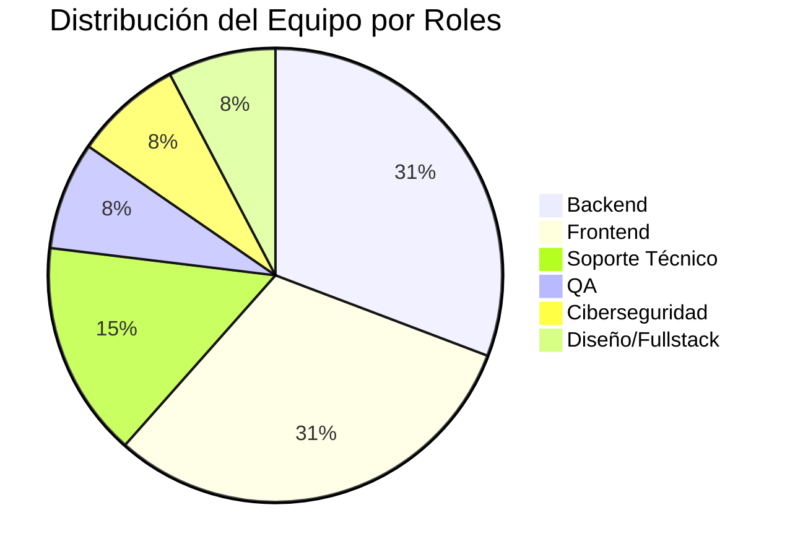

| Nombre                | Rol                     | Experiencia/Formación                     |
| --------------------- | ----------------------- | ---------------------------------------- |
| Anel Martez           | Backend Jr              | Primer trabajo como programador completo |
| Christian Blades      | Frontend Jr             | Ing. Sistemas ULACIX                     |
| Didiel Saenz          | QA                      | Ing. Sistemas, cursos automatización     |
| Edwar Vargas          | Soporte Técnico         | Logística Universidad del Istmo          |
| Eva Gutierrez         | Backend Jr              | UP Ing. Informática (2 meses)            |
| Flavio Sánchez        | Backend                 | UTP Lic. Desarrollo Software + Maestría  |
| Gloriam Luna          | Frontend                | UTP Ing. Sistemas y Computación          |
| Gustavo Jordan        | Diseño/Frontend/Backend | UTP Desarrollador Software               |
| Javier Quezada        | Ciberseguridad          | Ing. Sistemas Latina (sin culminar)      |
| Johan Miguel Ovalle   | Backend Jr              | UTP Ing. Sistemas y Computación          |
| Jonathan Nunez        | Frontend                | UTP Ing. Desarrollo Software             |
| Kelly Pindian         | Soporte Técnico         | -                                        |
| Luis Henrique Jarquin | Frontend/Soporte        | UMECIT Lic. Sistemas                     |

### **Principales Insights Identificados**

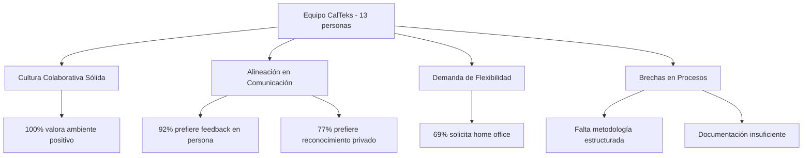

1. **Cultura colaborativa sólida:** 100% del equipo valora positivamente el ambiente de trabajo y la disposición de ayuda entre compañeros
2. **Alineación en preferencias de comunicación:** 92% prefiere feedback en persona y 77% prefiere reconocimiento privado
3. **Demanda masiva de flexibilidad:** 69% solicita home office como principal cambio deseado
4. **Brechas en procesos técnicos:** Falta de metodología estructurada y documentación clara afecta la productividad

### **Recomendaciones Prioritarias**

1. **Implementar política de trabajo híbrido** (1-2 días remotos por semana)
2. **Establecer procesos técnicos estructurados** (metodología de desarrollo, documentación, code review)
3. **Crear programa de desarrollo profesional** (certificaciones, mentoría, planes de carrera)

### **Estado General del Equipo**
**Nivel de satisfacción:** Alto (ambiente laboral valorado positivamente)  
**Nivel de engagement:** Medio-Alto (ambición profesional clara, pero necesidades no cubiertas)  
**Riesgo de rotación:** Medio (dependiente de implementación de mejoras solicitadas)

---

## **2. METODOLOGÍA Y ALCANCE**

### **Período de Realización**
Septiembre 2025

### **Formato de las Entrevistas**
Estructura de 5 secciones principales:
1. **Retroalimentación y objetivos** - Preferencias de comunicación y metas profesionales
2. **Expectativas** - Del equipo, liderazgo y empresa
3. **Empresa** - Percepción de CalTeks y áreas de mejora
4. **Nuestra relación** - Expectativas del rol de manager
5. **La pregunta clave** - Comidas favoritas (rapport building)

### **Objetivos del Proceso 1a1 Inicial**
- Establecer canales de comunicación efectivos
- Identificar objetivos profesionales individuales
- Mapear fortalezas y áreas de desarrollo del equipo
- Detectar problemas organizacionales y de proceso
- Crear base para relación manager-colaborador
-
--

## **3. ANÁLISIS POR DIMENSIONES**

### **3.1 Perfil del Equipo y Competencias**

#### **Distribución por Roles**
- **Backend:** 4 personas (31%) - Anel, Eva, Flavio, Johan
- **Frontend:** 4 personas (31%) - Christian, Gloriam, Jonathan, Luis
- **Soporte Técnico:** 2 personas (15%) - Edwar, Kelly
- **QA:** 1 persona (8%) - Didiel
- **Ciberseguridad:** 1 persona (8%) - Javier
- **Diseño/Fullstack:** 1 persona (8%) - Gustavo

#### **Nivel de Experiencia**
- **Junior:** 6 personas (46%) - Mayoría del equipo
- **Experiencia media:** 4 personas (31%)
- **Senior/Especializado:** 3 personas (23%) - Flavio, Didiel, Gustavo

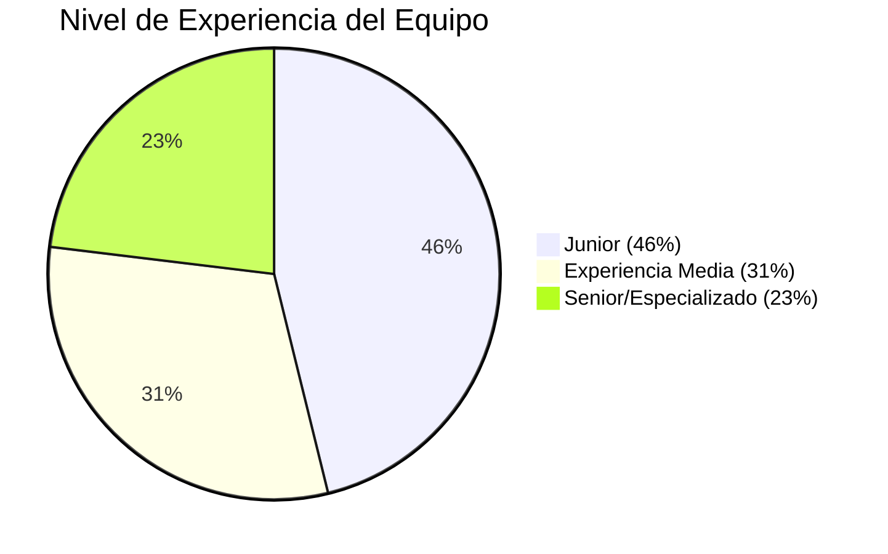

#### **Fortalezas Técnicas Identificadas**
- **Cobertura completa del stack:** Frontend, Backend, QA, DevOps, Ciberseguridad
- **Diversidad tecnológica:** React, Vue, Python, C#, .NET, PHP
- **Capacidad de aprendizaje:** Interés generalizado en certificaciones y nuevas tecnologías
- **Mentalidad colaborativa:** Disposición a ayudar entre áreas

#### **Áreas de Desarrollo - Gaps Técnicos Comunes**
- **Metodologías de desarrollo:** Falta de procesos estructurados
- **Documentación técnica:** Necesidad de estándares claros
- **Code review:** Proceso informal o inexistente
- **DevOps/CI-CD:** Oportunidad de especialización (interés de Flavio)

### **3.2 Preferencias de Comunicación y Feedback**

#### **Canales Preferidos para Retroalimentación**
- **En persona:** 12/13 (92%)
- **Chat/Teams:** 2/13 (15%) - Como complemento
- **Email:** 1/13 (8%) - Gloriam como opción adicional

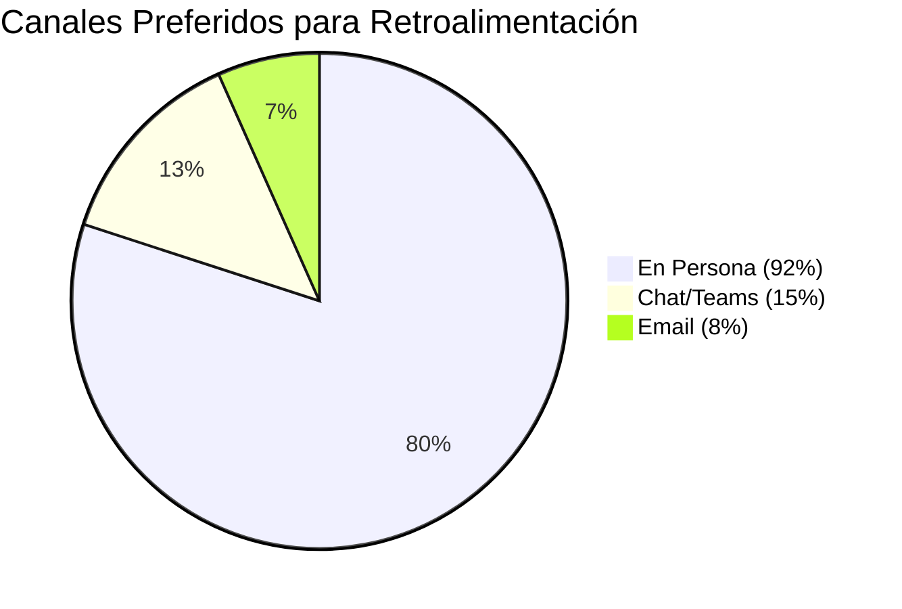

#### **Timing del Feedback**
- **En el momento:** 9/13 (69%)
- **En reuniones 1a1:** 3/13 (23%)
- **Ambos/Flexible:** 1/13 (8%)

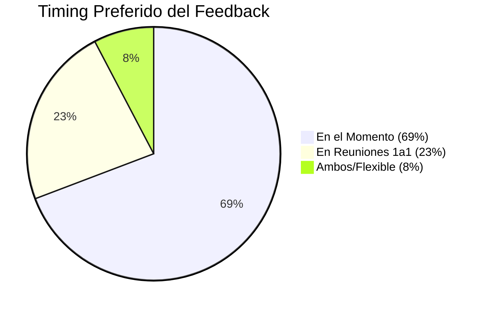

#### **Estilo de Reconocimiento**
- **Privado:** 10/13 (77%)
- **Público:** 2/13 (15%) - Eva, Gustavo
- **Ambos:** 1/13 (8%) - Jonathan

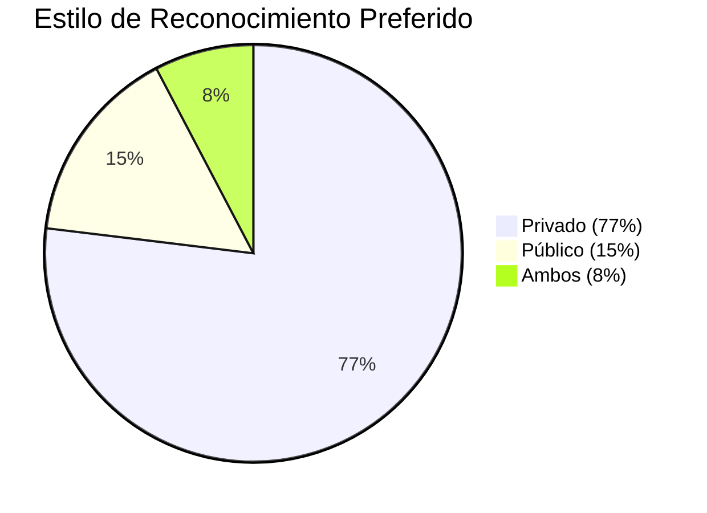

#### **Patrones Identificados**
- **Preferencia masiva por comunicación directa y personal**
- **Cultura de feedback inmediato y constructivo**
- **Valoración de la privacidad en reconocimientos**
- **Apertura a diferentes canales según el contexto**

### **3.3 Objetivos y Aspiraciones Profesionales**

#### **Metas a 12 Meses - Categorización**

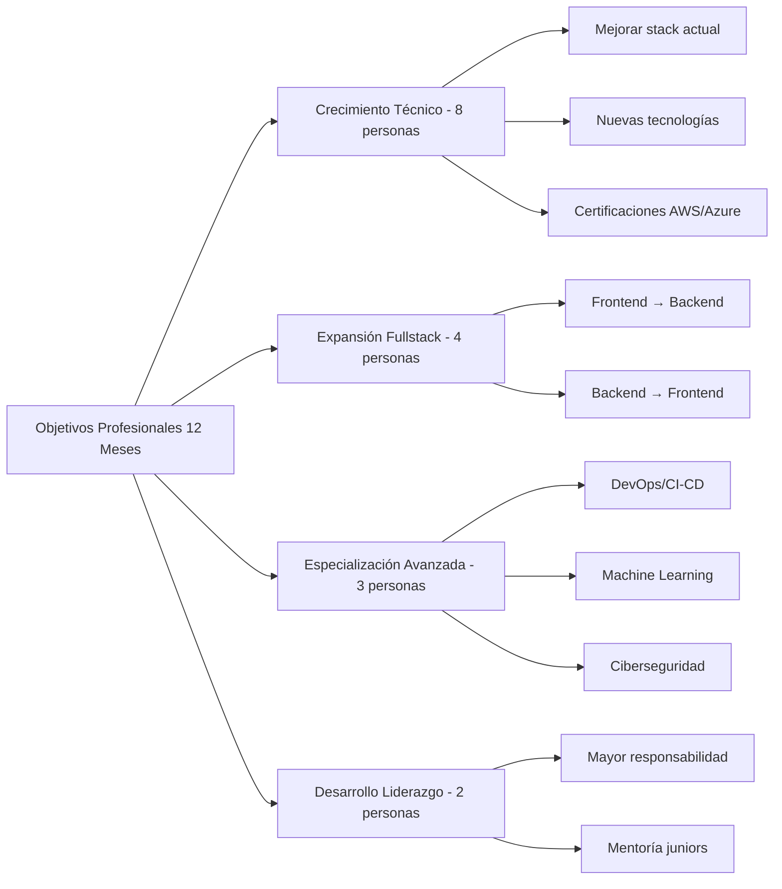

**Crecimiento Técnico (8 personas):**
- Mejorar habilidades en stack actual
- Dominar nuevas tecnologías
- Certificaciones técnicas (AWS, Azure, Pentesting)

**Expansión Fullstack (4 personas):**
- Frontend → Backend: Gloriam, Luis
- Backend → Frontend: Anel, Johan
- Especialización completa: Johan

**Especialización Avanzada (3 personas):**
- DevOps/CI-CD: Flavio
- Machine Learning/Data Science: Flavio
- Ciberseguridad: Javier

**Desarrollo de Liderazgo (2 personas):**
- Responsabilidades mayores: Eva, Gustavo
- Mentoría a juniors: Varios

#### **Metas a 3 Meses - Prioridades Inmediatas**
- **Fluidez en proyectos actuales:** Eva, Anel
- **Independencia en resolución de problemas:** Luis, Anel
- **Certificaciones específicas:** Javier (Pentesting)
- **Mejora en lógica de programación:** Christian
- **Apoyo en backend:** Luis

#### **Factores de Productividad**
**Música:** 8/13 (62%) trabajan mejor con música  
**Bloques de tiempo:** 7/13 (54%) necesitan tiempo sin interrupciones  
**Trabajo en pareja:** Mixto - algunos lo prefieren, otros no  
**Organización:** Apuntes, metodología clara (Luis)

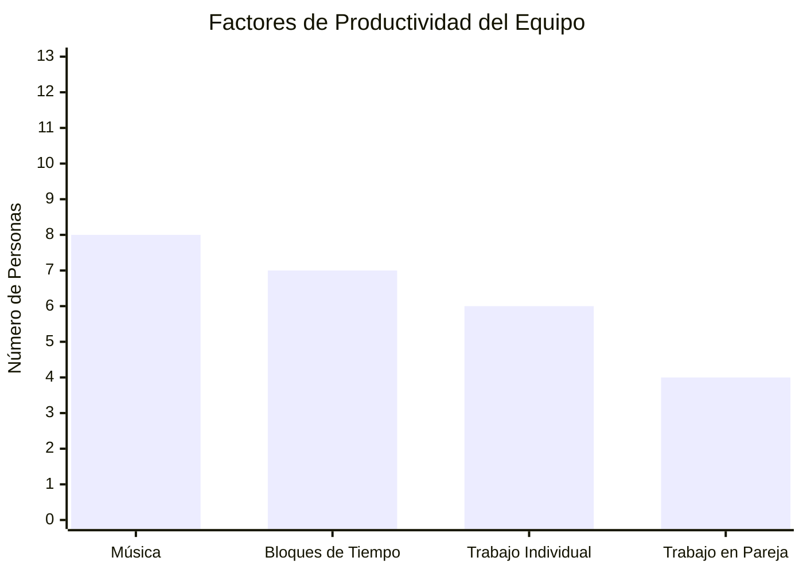

#### **Necesidades de Desarrollo**
- **Mentoría técnica:** Solicitada por 6 personas
- **Certificaciones:** Interés generalizado
- **Procesos claros:** Definición de tareas y metodología
- **Feedback técnico:** Code review y mejores prácticas#
## **3.4 Expectativas y Relaciones**

#### **Expectativas del Equipo - Colaboración Interna**
**Aspectos Positivos Valorados:**
- Unidad y apoyo mutuo (Christian, Eva)
- Ambiente colaborativo sin conflictos (Johan, Didiel)
- Disposición de ayuda cuando se necesita (Todos)

**Áreas de Mejora Identificadas:**
- Conflictos entre algunos compañeros (mencionado por Anel)
- Problemas de comunicación frontend-backend (Flavio)
- Necesidad de mejor coordinación en procesos (Varios)

#### **Expectativas del Liderazgo - Qué Esperan del Manager**
**Comportamientos Valorados:**
- **Escucha activa y comunicación clara** (Gustavo, Eva)
- **Apoyo técnico y mentoría** (Anel, Christian, Luis)
- **Feedback constructivo y oportuno** (Flavio, Didiel)
- **Solución de problemas y bloqueos** (Anel, Johan)
- **Trato justo y sin favoritismos** (Gustavo)

**Áreas de Enfoque Sugeridas:**
- Seguimiento de tareas y progreso (Johan, Javier)
- Definición clara de requerimientos (Eva, Johan)
- Mentoría técnica (Anel, Christian)
- Gestión de conflictos del equipo (Eva)

#### **Expectativas de la Empresa - Desarrollo Profesional y Ambiente**
**Desarrollo Profesional:**
- Oportunidades de aprendizaje y certificaciones
- Crecimiento organizacional y nuevos proyectos
- Reconocimiento del esfuerzo y desempeño

**Ambiente Laboral:**
- Mantenimiento del ambiente tranquilo actual
- Mayor flexibilidad (home office, código vestimenta)
- Procesos más claros y estructurados

#### **Dinámicas Interpersonales - Conflictos Identificados**
**Tensiones Reportadas:**
- Conflictos entre algunos compañeros de frontend (Anel)
- Problemas de comunicación entre áreas (Flavio)
- Diferencias en estilos de trabajo (Kelly observaciones)
- Necesidad de mediación en algunos casos

### **3.5 Percepción de la Empresa y Cultura**

#### **Aspectos Positivos - Lo Más Valorado de CalTeks**
**Ambiente de Trabajo (Mencionado por 10+ personas):**
- Tranquilidad y ambiente relajado
- Autonomía en el trabajo
- Flexibilidad (no marcar tarjeta)
- Compañeros colaborativos

**Oportunidades Profesionales:**
- Proyectos retadores y variados (Christian, Johan)
- Crecimiento del departamento (Didiel, Luis)
- Diversidad tecnológica (Didiel)
- Independencia en decisiones técnicas (Gloriam)

#### **Áreas de Mejora - Cambios Deseados**
**Principal Solicitud - Home Office/Remoto:**
- **9/13 personas (69%)** solicitan trabajo remoto
- Desde 1-2 días por semana hasta completamente remoto
- Principal cambio deseado en la empresa

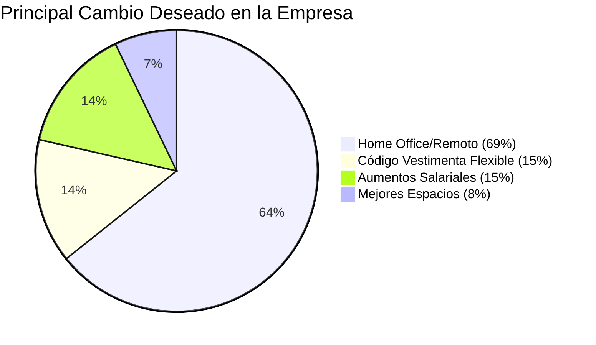

**Otras Mejoras Solicitadas:**
- **Código de vestimenta:** Más flexibilidad (Javier, Gloriam)
- **Aumentos salariales:** Reconocimiento económico (Anel, Gloriam)
- **Mejores espacios:** Mayor privacidad (Johan)
- **Procesos más claros:** Metodología y comunicación

#### **Colaboración y Apoyo - Nivel de Satisfacción**
**Satisfacción Alta:** 11/13 (85%) se sienten apoyados por compañeros  
**Áreas de Mejora:** Comunicación entre departamentos, resolución de conflictos

#### **Motivadores - Qué los Emociona del Futuro**
- **Crecimiento empresarial:** Nuevos clientes y proyectos
- **Impacto del trabajo:** Productos usados a nivel mundial (Gustavo)
- **Desarrollo tecnológico:** Trabajar con nuevas tecnologías (Anel)
- **Crecimiento del equipo:** Expansión del departamento (Didiel, Luis)---


## **4. HALLAZGOS CRÍTICOS**

### **Fortalezas del Equipo - Capacidades y Activos**

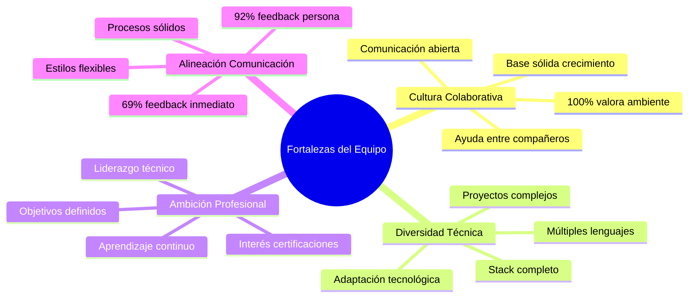

#### **1. Cultura Colaborativa Excepcional**
- **100% del equipo** valora positivamente el ambiente laboral
- Disposición natural de ayuda entre compañeros
- Respeto mutuo y comunicación abierta
- Base cultural sólida para crecimiento organizacional

#### **2. Diversidad Técnica Completa**
- Cobertura total del stack tecnológico necesario
- Experiencia en múltiples lenguajes y frameworks
- Capacidad de adaptación a nuevas tecnologías
- Potencial para proyectos complejos y variados

#### **3. Ambición Profesional Clara**
- Objetivos de crecimiento definidos en todos los miembros
- Interés genuino en certificaciones y especialización
- Mentalidad de aprendizaje continuo
- Potencial de liderazgo técnico interno

#### **4. Alineación en Comunicación**
- Preferencias consistentes de feedback (92% en persona)
- Cultura de feedback inmediato (69%)
- Apertura a diferentes estilos según contexto
- Base sólida para establecer procesos de comunicación

### **Riesgos y Desafíos - Problemas Recurrentes**

#### **1. Brecha Crítica en Procesos Técnicos**
**Impacto:** Afecta productividad y calidad del trabajo
- Falta de metodología de desarrollo estructurada
- Documentación técnica insuficiente o inexistente
- Procesos de code review informales
- Descoordinación entre frontend y backend

**Evidencia:**
- "Falta de concordancia entre tareas del backend y del frontend" (Flavio)
- "Las tareas de Jira poco claras o mal definidas" (Eva, Johan)
- "Necesidad de historias de usuario más detalladas" (Flavio)

#### **2. Desconexión Expectativas vs. Políticas Organizacionales**
**Impacto:** Riesgo de rotación y desmotivación
- 69% solicita home office vs. política actual presencial
- Expectativas de flexibilidad vs. código de vestimenta rígido
- Demanda de crecimiento salarial vs. estructura actual

**Evidencia:**
- "Home office" mencionado por 9/13 personas como principal cambio
- "Código de vestimenta" como barrera (Javier, Gloriam)
- Múltiples menciones de aumentos salariales

#### **3. Tensiones Interpersonales Latentes**
**Impacto:** Puede escalar y afectar productividad del equipo
- Conflictos reportados entre algunos miembros
- Problemas de comunicación entre áreas técnicas
- Diferencias en estilos de trabajo no resueltas

**Evidencia:**
- "Conflictos entre ciertos compañeros" (Anel)
- Observaciones detalladas de dinámicas interpersonales (Kelly)
- Necesidad de mediación en algunos casos

### **Oportunidades - Áreas de Crecimiento**

#### **1. Desarrollo de Liderazgo Técnico Interno**
**Potencial:** Crear estructura de liderazgo distribuido
- Flavio: Experiencia técnica avanzada, interés en DevOps/ML
- Gustavo: Habilidades de diseño y visión de producto
- Luis: Capacidad de organización y gestión de proyectos
- Didiel: Experiencia en QA y procesos

#### **2. Programa de Certificaciones Estructurado**
**Potencial:** Elevar nivel técnico del equipo completo
- Interés generalizado en certificaciones (AWS, Azure, Pentesting)
- Oportunidad de especialización por áreas
- ROI alto en capacidades técnicas del equipo
- Diferenciación competitiva en el mercado

#### **3. Implementación de Metodología Ágil**
**Potencial:** Resolver múltiples problemas de proceso
- Mejorar coordinación frontend-backend
- Establecer definición clara de tareas
- Implementar code review estructurado
- Crear cultura de documentación técnica

### **Brechas Críticas - Necesidades No Cubiertas**

#### **1. Estructura de Desarrollo Profesional**
- **Falta:** Planes de carrera claros y estructurados
- **Necesidad:** Rutas de crecimiento definidas por rol
- **Impacto:** Retención de talento y motivación

#### **2. Procesos de Gestión de Proyectos**
- **Falta:** Metodología consistente de desarrollo
- **Necesidad:** Estándares de calidad y documentación
- **Impacto:** Productividad y calidad del producto

#### **3. Políticas de Flexibilidad Laboral**
- **Falta:** Opciones de trabajo remoto/híbrido
- **Necesidad:** Adaptación a expectativas modernas
- **Impacto:** Satisfacción laboral y competitividad en retención---


## **5. RECOMENDACIONES Y PLAN DE ACCIÓN**

### **Acciones Inmediatas (30 días)**

#### **1. Establecer Reuniones 1a1 Regulares**
**Objetivo:** Mantener comunicación directa y seguimiento personalizado
- **Frecuencia:** Mensual (preferencia de 8/13 personas)
- **Formato:** En persona, 45-60 minutos
- **Agenda:** Progreso, bloqueos, feedback, desarrollo profesional
- **Responsable:** Manager directo
- **Recursos:** Tiempo dedicado, sala privada

#### **2. Implementar Daily Standups**
**Objetivo:** Mejorar coordinación diaria y comunicación entre equipos
- **Formato:** 15 minutos diarios, presencial o híbrido
- **Participantes:** Todo el equipo técnico
- **Agenda:** Progreso del día anterior, plan del día, bloqueos
- **Beneficio:** Resolver descoordinación frontend-backend

#### **3. Crear Templates Mejorados para Jira**
**Objetivo:** Resolver problema de tareas mal definidas
- **Incluir:** Criterios de aceptación claros
- **Formato:** Historias de usuario estructuradas
- **Elementos:** Datos de entrada, salida, casos de prueba
- **Responsable:** Manager + Flavio (experiencia técnica)

### **Iniciativas a Mediano Plazo (3 meses)**

#### **1. Programa de Mentoría Técnica**
**Objetivo:** Acelerar desarrollo de juniors y compartir conocimiento
- **Estructura:** Senior-Junior pairs
- **Mentores:** Flavio, Gustavo, Didiel
- **Mentees:** Anel, Eva, Christian, Johan
- **Actividades:** Code review, pair programming, sesiones técnicas
- **Seguimiento:** Progreso mensual en 1a1s

#### **2. Proceso de Code Review Estructurado**
**Objetivo:** Mejorar calidad de código y compartir conocimiento
- **Herramienta:** Git-based review process
- **Estándares:** Definir criterios de calidad por tecnología
- **Participación:** Obligatorio para todos los commits
- **Capacitación:** Workshop inicial sobre mejores prácticas

#### **3. Evaluación de Política de Trabajo Híbrido**
**Objetivo:** Abordar principal solicitud del equipo (69%)
- **Propuesta:** 1-2 días de home office por semana
- **Piloto:** 3 meses con métricas de productividad
- **Criterios:** Entregables, comunicación, colaboración
- **Evaluación:** Impacto en productividad y satisfacción

### **Estrategias a Largo Plazo (6-12 meses)**

#### **1. Programa de Certificaciones Técnicas**
**Objetivo:** Elevar capacidades técnicas del equipo
- **Presupuesto:** Asignación anual por persona
- **Prioridades:** AWS/Azure (Backend), Pentesting (Ciberseguridad)
- **Incentivos:** Reconocimiento y ajuste salarial post-certificación
- **Seguimiento:** Planes individuales en 1a1s

#### **2. Establecimiento de Roles de Liderazgo Técnico**
**Objetivo:** Crear estructura de liderazgo distribuido
- **Tech Leads por área:** Frontend, Backend, QA, DevOps
- **Responsabilidades:** Arquitectura, mentoría, estándares técnicos
- **Candidatos:** Flavio (Backend/DevOps), Gustavo (Frontend/Diseño)
- **Desarrollo:** Plan de crecimiento hacia liderazgo

#### **3. Implementación de Metodología Ágil Completa**
**Objetivo:** Resolver problemas de proceso de manera integral
- **Framework:** Scrum adaptado al contexto del equipo
- **Roles:** Product Owner, Scrum Master, Development Team
- **Ceremonias:** Sprint planning, daily standups, retrospectives
- **Herramientas:** Jira optimizado, documentación técnica

### **Recursos Necesarios**

#### **Presupuesto Estimado**
- **Certificaciones:** $2,000-3,000 por persona/año
- **Herramientas:** $500-1,000/mes (Jira, Git, documentación)
- **Capacitación:** $5,000-10,000 para workshops y cursos
- **Espacios:** Adecuación para trabajo híbrido

#### **Tiempo de Implementación**
- **Manager:** 20% tiempo adicional para 1a1s y seguimiento
- **Equipo:** 10% tiempo para ceremonias y procesos nuevos
- **Capacitación:** 2-3 días por trimestre para workshops

#### **Herramientas Requeridas**
- **Comunicación:** Teams, Slack para trabajo remoto
- **Desarrollo:** Git workflows, CI/CD tools
- **Documentación:** Confluence, Wiki técnico
- **Seguimiento:** Dashboards de productividad y satisfacción

### **Responsables y Timeline**

#### **Responsabilidades por Rol**
**Manager Directo:**
- Reuniones 1a1 mensuales
- Seguimiento de planes de desarrollo
- Mediación de conflictos
- Evaluación de políticas

**Tech Leads (a desarrollar):**
- Mentoría técnica
- Code review y estándares
- Arquitectura de soluciones
- Capacitación del equipo

**Recursos Humanos:**
- Políticas de trabajo híbrido
- Programa de certificaciones
- Evaluaciones de desempeño
- Resolución de conflictos organizacionales

#### **Timeline de Implementación**
**Mes 1:** Reuniones 1a1, daily standups, templates Jira  
**Mes 2-3:** Programa mentoría, code review, evaluación híbrido  
**Mes 4-6:** Certificaciones, tech leads, metodología ágil  
**Mes 7-12:** Optimización, expansión, evaluación de resultados

```mermaid
gantt
    title Plan de Implementación - Recomendaciones 1a1
    dateFormat  YYYY-MM-DD
    section Acciones Inmediatas
    Reuniones 1a1 Regulares    :active, immediate1, 2025-10-01, 30d
    Daily Standups             :active, immediate2, 2025-10-01, 30d
    Templates Jira Mejorados   :active, immediate3, 2025-10-01, 30d
    
    section Mediano Plazo
    Programa Mentoría          :medium1, 2025-11-01, 90d
    Code Review Estructurado   :medium2, 2025-11-01, 90d
    Evaluación Trabajo Híbrido :medium3, 2025-11-01, 90d
    
    section Largo Plazo
    Programa Certificaciones   :long1, 2026-01-01, 365d
    Tech Leads                 :long2, 2026-01-01, 365d
    Metodología Ágil Completa  :long3, 2026-01-01, 365d
```-
--

## **6. CONCLUSIONES**

### **Estado General del Equipo**

#### **Panorama Actual**
El equipo de tecnología de CalTeks presenta un **perfil excepcional** con características que lo posicionan para un crecimiento significativo. Se trata de un grupo de 13 profesionales que abarca todas las competencias técnicas necesarias, con una **cultura colaborativa sólida** y **ambición profesional clara**.

**Indicadores Positivos:**
- **100% satisfacción** con el ambiente laboral
- **92% alineación** en preferencias de comunicación
- **Diversidad técnica completa** (Frontend, Backend, QA, Ciberseguridad, Diseño)
- **Mentalidad de crecimiento** en todos los miembros

#### **Desafíos Identificados**
Los principales retos son **solucionables** y se centran en tres áreas:
1. **Procesos técnicos:** Falta de metodología estructurada
2. **Políticas organizacionales:** Desconexión con expectativas del equipo
3. **Desarrollo profesional:** Necesidad de rutas de crecimiento claras

### **Prioridades de Liderazgo**

#### **Enfoque Inmediato (Próximos 90 días)**
1. **Mantener y potenciar la cultura colaborativa existente**
   - Es el activo más valioso del equipo
   - Base para todos los demás desarrollos
   - Requiere protección activa durante cambios

2. **Implementar estructura sin perder flexibilidad**
   - Procesos técnicos claros pero adaptables
   - Metodología que respete estilos de trabajo individuales
   - Balance entre estructura y autonomía valorada

3. **Abordar expectativas de flexibilidad laboral**
   - Evaluar política de trabajo híbrido
   - Comunicar timeline y criterios de decisión
   - Piloto controlado para medir impacto

#### **Desarrollo a Mediano Plazo (3-6 meses)**
1. **Crear estructura de liderazgo técnico interno**
   - Identificar y desarrollar tech leads naturales
   - Distribuir responsabilidades de mentoría
   - Establecer rutas de crecimiento claras

2. **Profesionalizar procesos de desarrollo**
   - Metodología ágil adaptada al contexto
   - Code review estructurado
   - Documentación técnica estándar

### **Indicadores de Seguimiento**

#### **Métricas de Satisfacción**
- **Retención del equipo:** Meta 95%+ (actualmente alto)
- **Satisfacción en 1a1s:** Escala 1-10, meta 8+
- **Participación en iniciativas:** Meta 80%+ engagement

#### **Métricas de Productividad**
- **Tiempo de entrega:** Reducción 20% con mejores procesos
- **Calidad de código:** Reducción bugs 30% con code review
- **Coordinación equipos:** Reducción bloqueos 40% con daily standups

#### **Métricas de Desarrollo**
- **Certificaciones obtenidas:** Meta 2-3 por persona/año
- **Promociones internas:** Meta 2-3 tech leads en 12 meses
- **Capacitación completada:** 100% participación en workshops

### **Frecuencia Recomendada para Próximas 1a1**

#### **Basado en Preferencias del Equipo**
- **Mensual:** 8/13 personas (62%) - **Recomendación principal**
- **Cada 2 meses:** 3/13 personas (23%)
- **Flexible:** 2/13 personas (15%)

```mermaid
pie title Frecuencia Preferida para Reuniones 1a1
    "Mensual (62%)" : 8
    "Cada 2 Meses (23%)" : 3
    "Flexible (15%)" : 2
```

#### **Estructura Sugerida para 1a1s Mensuales**
**Duración:** 45-60 minutos  
**Formato:** En persona (preferencia 92%)  
**Agenda estándar:**
1. Progreso en objetivos personales (15 min)
2. Bloqueos y necesidades de apoyo (15 min)
3. Feedback bidireccional (10 min)
4. Desarrollo profesional y próximos pasos (10 min)
5. Temas abiertos (5 min)

### **Reflexión Final**

#### **Potencial del Equipo**
Este equipo tiene **todos los ingredientes para ser excepcional**:
- ✅ **Talento técnico diverso y competente**
- ✅ **Cultura colaborativa establecida**
- ✅ **Ambición profesional clara**
- ✅ **Ambiente laboral valorado positivamente**
- ✅ **Alineación en estilos de comunicación**

#### **Factores Críticos de Éxito**
El éxito futuro depende de la capacidad de liderazgo para:

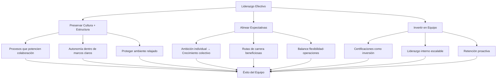

1. **Preservar la cultura mientras se implementa estructura**
   - Los procesos deben potenciar, no inhibir, la colaboración
   - Mantener autonomía valorada dentro de marcos claros
   - Proteger el ambiente relajado durante períodos de cambio

2. **Alinear expectativas individuales con objetivos organizacionales**
   - Convertir ambición individual en crecimiento colectivo
   - Crear rutas de carrera que beneficien tanto al individuo como a la empresa
   - Balancear necesidades de flexibilidad con requerimientos operacionales

3. **Invertir en el equipo como ventaja competitiva**
   - Programa de certificaciones como inversión, no gasto
   - Desarrollo de liderazgo interno para escalabilidad
   - Políticas de retención proactivas vs. reactivas

#### **Oportunidad Estratégica**
**La inversión en este equipo tiene potencial de retornos exponenciales:**
- **Productividad:** Procesos estructurados + talento motivado
- **Calidad:** Code review + certificaciones + mentoría
- **Innovación:** Diversidad técnica + ambiente colaborativo + crecimiento profesional
- **Escalabilidad:** Liderazgo interno + procesos claros + cultura sólida

**Recomendación final:** Priorizar la implementación de las acciones inmediatas y mantener comunicación constante sobre el progreso. Este equipo está listo para dar el siguiente salto de madurez organizacional.---


## **7. ANEXOS**

### **A. Perfiles Individuales Resumidos**

#### **Desarrolladores Backend**
**Anel Martez (Jr)** - Primer trabajo completo, necesita mentoría, interés en frontend  
**Eva Gutierrez (Jr)** - 2 meses experiencia, alta motivación, busca responsabilidades  
**Flavio Sánchez** - Más experimentado, interés DevOps/ML, potencial tech lead  
**Johan Miguel Ovalle (Jr)** - Aspira fullstack, buena actitud colaborativa

#### **Desarrolladores Frontend**
**Christian Blades (Jr)** - Ing. Sistemas, busca estabilidad y crecimiento  
**Gloriam Luna** - Experiencia sólida, aspira backend, independiente  
**Jonathan Nunez** - Experiencia en diseño UI, prefiere autonomía  
**Luis Henrique Jarquin** - Interés backend, habilidades organización

#### **Especialistas**
**Didiel Saenz (QA)** - Experiencia automatización, mentor potencial  
**Javier Quezada (Ciberseguridad)** - Busca certificaciones, colaborativo  
**Gustavo Jordan (Diseño/Fullstack)** - Multidisciplinario, potencial liderazgo

#### **Soporte Técnico**
**Edwar Vargas** - Transición a desarrollo, interés QA manual  
**Kelly Pindian** - Observadora del equipo, insights valiosos sobre dinámicas

### **B. Datos Cuantitativos Clave**

#### **Preferencias de Comunicación**
- En persona: 92% (12/13)
- Feedback inmediato: 69% (9/13)
- Reconocimiento privado: 77% (10/13)
- Reuniones 1a1 mensuales: 62% (8/13)

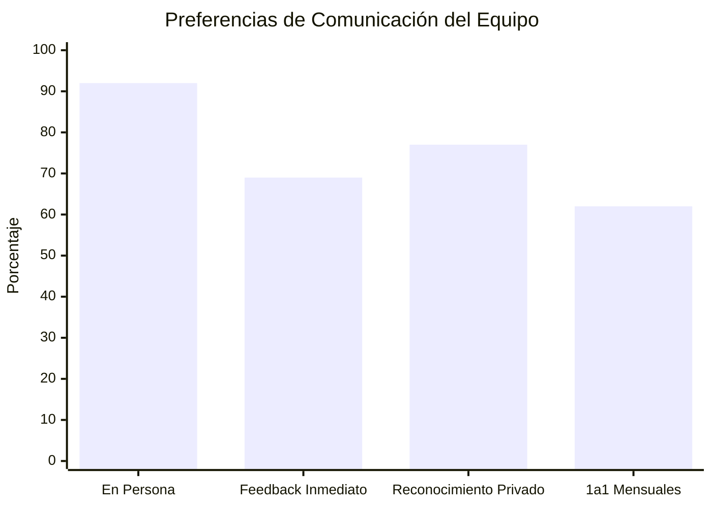

#### **Solicitudes de Cambio**
- Home office: 69% (9/13)
- Código vestimenta flexible: 15% (2/13)
- Aumentos salariales: 15% (2/13)
- Mejores espacios: 8% (1/13)

#### **Factores de Productividad**
- Música: 62% (8/13)
- Bloques de tiempo: 54% (7/13)
- Trabajo individual: 46% (6/13)
- Trabajo en pareja: 31% (4/13)

### **C. Comidas Favoritas del Equipo** 🍕

#### **Comidas Principales**
- **Hamburguesas:** 4 personas (Didiel, Eva, Flavio, Luis)
- **Pizza:** 3 personas (Anel, Gloriam, Jonathan)
- **Pollo:** 2 personas (Christian, Johan)
- **Asiática:** 1 persona (Kelly)
- **Pasta:** 1 persona (Edwar)
- **Sushi/Fideos:** 1 persona (Gustavo)

#### **Postres Favoritos**
- **Cheesecake:** 3 personas (Didiel, Javier, Jonathan)
- **Helado de chocolate:** 2 personas (Flavio)
- **Dulces variados:** Gloriam, Eva, Johan
- **Otros:** Arroz con leche (Anel), Twix (Christian), Pudín (Gustavo), Donas (Luis), Mochi (Kelly)

---

**Reporte generado:** Septiembre 2025  
**Autor:** Ricardo Cuan - Senior Software Engineer
**Confidencialidad:** Uso interno CalTeks  
**Próxima revisión:** Diciembre 2025

---

*Este reporte es confidencial y está destinado únicamente para uso interno de CalTeks. La información contenida refleja las opiniones y expectativas expresadas por los miembros del equipo durante las reuniones 1a1 iniciales y debe ser tratada con la debida confidencialidad y respeto hacia los participantes.*
